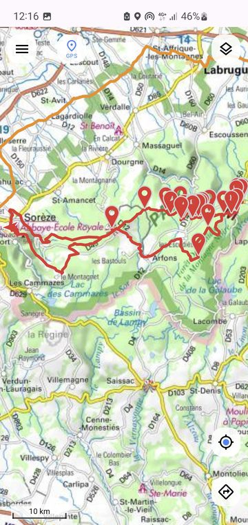
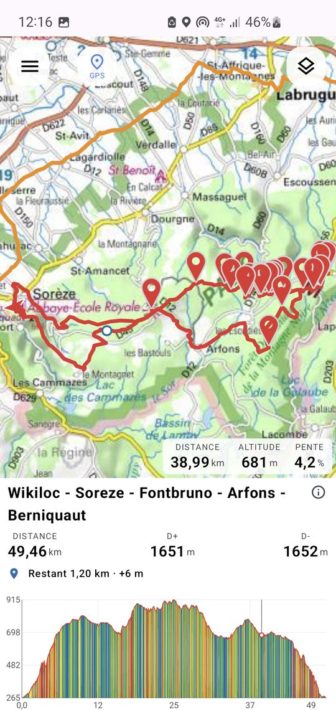
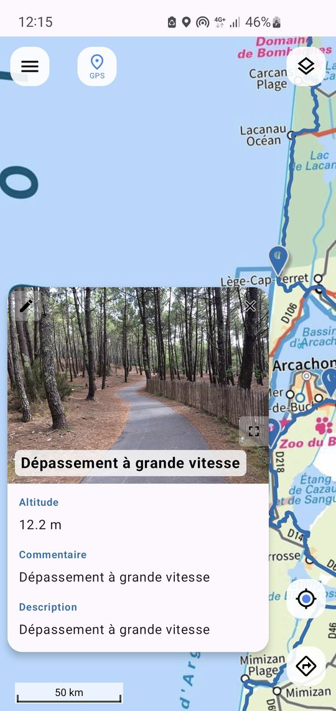
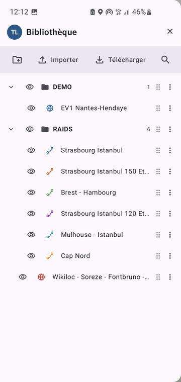
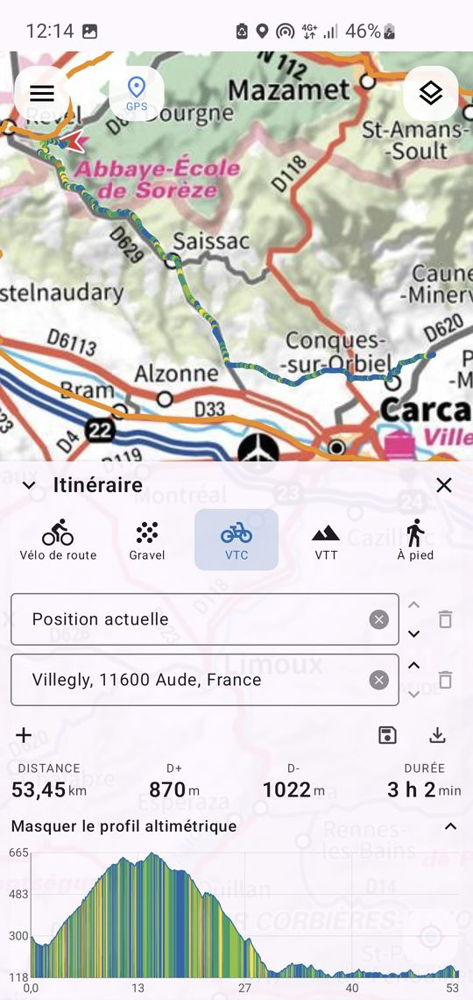
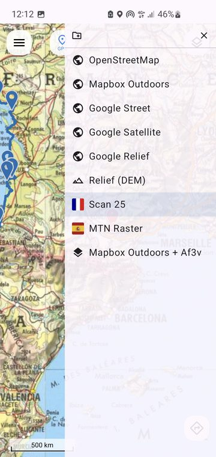
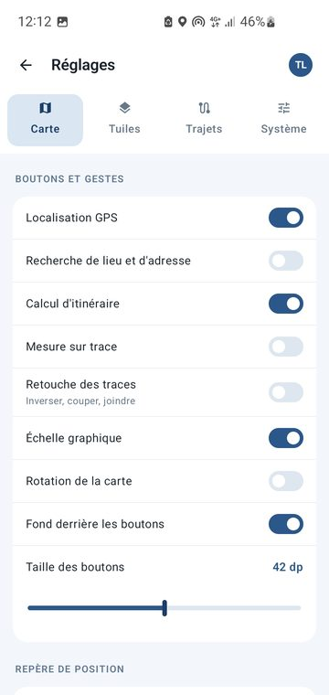

# Trailog

[ Français](README.fr.md) |  English

**Offline mapping and routes for Android.**

Trailog is a native Android application for viewing, importing and organising GPS tracks
(hiking, cycling, mountain biking, exploring), on customisable basemaps, and built for
offline use.

<table width="100%">
  <tr>
    <td colspan="3" align="center"> A track on the map</td>
  </tr>
  <tr>
    <td align="center" width="33.3%"> Elevation profile, synchronised</td>
    <td align="center" width="33.3%"> Marker bubble, photo included</td>
    <td align="center" width="33.3%"> Library of folders and layers</td>
  </tr>
  <tr>
    <td align="center"> Route planner</td>
    <td align="center"> Basemap manager</td>
    <td align="center"> Settings, Map tab</td>
  </tr>
</table>

> The project's working documents (specification, design notes, tests) are written in French.
> This README is their English counterpart.

---

## Table of contents

- [What is Trailog?](#what-is-trailog)
- [Main features](#main-features)
- [Installation](#installation)
- [Quick start](#quick-start)
- [Going further](#going-further)
- [Data & Privacy](#data--privacy)
- [Contributing & Development](#contributing--development)
- [Licence](#licence)
- [Contact](#contact)

---

## What is Trailog?

Trailog keeps your tracks and points of interest organised locally on your phone, and shows
them on a map with a synchronised elevation profile, without depending on any online service.

**Typical uses:**
- Hiking, cycling, mountain biking: follow a route prepared in advance, offline in the field.
- Archiving personal tracks, sorted into folders.
- Exploring specialised basemaps (national mapping agencies, hillshade, cycle routes...).

## Main features

- **Native map** (MapLibre) with many configurable basemaps (OpenStreetMap, national mapping
  agencies, hillshade, cycle routes, composite basemaps pairing a base with an overlay).
- **Track import** in **GPX**, **GeoJSON** and **KML/KMZ**, with statistics computed on the fly
  (distance, ascent and descent, gradient, moving time).
- **Native elevation profile**, synchronised with a cursor on the map, with zoom on a section of
  the route and an adjustable vertical scale.
- **Folder organisation**: create, rename, move and delete folders and routes, and colour every
  track in a folder in one go.
- **Points of interest**: markers with info bubbles you can edit (title, text, links, photos),
  including photos carried by GPX waypoints on your phone.
- **Offline maps**: download an area to take it along with no network, import your own **MBTiles**
  basemaps, and tiles already viewed stay in cache.
- **Place and address search** (to be enabled in settings): the place found is pinned on the map,
  with its address.
- **Long press on the map**: anywhere off a track, an info bubble gives the address of the spot
  touched, and measures the distance and time to reach it - from your GPS position, or from a
  second point you pick.
- **Measuring along a track** (to be enabled in settings): put two points on a displayed track and
  Trailog gives the distance between them **along the route**, with no network.
- **Off-track alert** (to be enabled in the settings): pick the track you are following from the ones
  nearest to you, and Trailog warns you - a banner at the bottom of the screen, and a sound if you
  want one - as soon as you stray from it by more than the distance you set.
- **Built-in updates**: the app tells you about a new version and installs it for you.
- **Multilingual**: interface available in French, English, German, Spanish, Catalan, Basque,
  Italian and Portuguese.
- Customisable settings: units, touch selection tolerance, avatar, info bubble position, text sizes.

## Installation

**Requirements:** Android 7.0 (API 24) or later.

### From GitHub Releases (recommended)

1. Open the repository's [Releases](https://github.com/lc-4918/trailog/releases) page.
2. Download the `.apk` file of the latest version.
3. Open the downloaded file on your phone (allow installation from an unknown source if Android
   asks for it).
4. Confirm the installation.

> Trailog is not distributed on the Play Store: GitHub Releases serves as the distribution
> platform. See [Contributing & Development](#contributing--development) for how this "store"
> works.

### Updates

Once that first installation is done, you will not have to come back here: Trailog checks for
itself whether a newer version exists and offers to install it.

- By default, the check happens **at startup**.
- You can switch it to **manual** under **Settings -> System -> Updates**, where a button then lets
  you check whenever you want.
- When you accept, Trailog downloads the new version and starts the installation. Android will ask
  you once for permission to install applications from Trailog: this is normal for an application
  distributed outside a store, and you can withdraw it at any time in the Android settings.
- Your tracks, folders and settings are kept.

## Quick start

1. **Import a track**: *Import* button -> pick a GPX, GeoJSON or KML/KMZ file -> the app computes
   the statistics and shows a preview.
2. **Choose the destination**: an existing folder, or a new one (folder or subfolder).
3. **View it**: tap the route in the side menu -> it appears on the map, with its elevation
   profile. Tapping the map or the profile puts the cursor on the matching point in the other view.
4. **Add points of interest**: import a point layer (GeoJSON/GPX/KML), tap a marker to see its info
   bubble. The pencil opens it for editing.

## Going further

- **Import/export**: GeoJSON, GPX and KML/KMZ on import; GeoJSON export of tracks. Photos
  referenced by GPX waypoints (OruxMaps, OsmAnd, Locus, Garmin) are collected and stored in the
  application.
- **Editing an info bubble**: the pencil opens a form where you can change the title, fix a field,
  add text, a link or a photo, choose the featured photo, or delete the point.
- **Taking a map offline**: draw an area on the map, choose the zoom range, and Trailog downloads
  the tiles into a layer usable with no network.
- **Basemaps**: manage the list of tile providers in the settings (URL, API key, activation),
  create **composite basemaps** (an opaque base plus an overlay, for instance OpenStreetMap with
  mountain bike routes).
- **Local offline basemaps**: import an `.mbtiles` file for a basemap usable without a connection.
- **Basemap legend**: some basemaps, such as the AF3V cycle routes, show an information button on
  the map that unfolds their legend.
- **Searching for a place**: once geocoding is enabled in **Settings / Map**, a search button
  appears below the menu. The chosen place is pinned in black on the map, and its info bubble gives
  the address. Suggestions are ranked by the importance of the place, so a town comes before a
  hamlet of the same name.
- **Querying a point on the map**: a long press anywhere, off a track and off a marker, drops a pin
  there and opens its info bubble. It first looks up the address of that spot, then offers two
  measurements: the distance from your GPS position (if it is on), and the distance from a second
  point, which you then pick with a tap on the map.
- **Distance and time to the point**: these are not straight-line distances but those of the
  recommended route, computed for the **discipline** set in *Settings / Routes*: road bike, gravel,
  hybrid, mountain bike or on foot. The small "i" next to the value is the reminder. The route
  itself is drawn on the map, tinted by gradient. The services queried are **Photon** (addresses)
  and **Valhalla** (routes), with no account and no key; you can point them at your own instances
  by entering their URLs in the settings.
- **Measuring a section of a track**: once *Show the measure button* is enabled in
  **Settings / Map**, a ruler button appears below the menu. A band then asks for two points: tap
  the start on a displayed track, then the end on the same track, and the distance between them
  along the route appears between the two markers. No need to aim at the line pixel by pixel: each
  tap is snapped to the nearest track, and a tap beyond the end of a track lands on that end. You
  can pan and zoom the map between the two points, the info bubble stays visible and settles as
  close as it can to the middle of the measured section. Its cross clears the measurement.
- **Hillshade**: enable relief shading in the map settings.
- **Elevation profile**: zoom on a section by choosing a start and an end (up to three levels),
  adjust the smoothing and the vertical scale (for instance 1 cm = 100 m, so that the same gradient
  always takes up the same height).
- **Personalisation**: avatar, units (metric/imperial), how the menu opens (button or swipe), touch
  selection tolerance, info bubble position.

## Data & Privacy

- No online tracking, no telemetry, no account.
- All tracks, points and settings are stored **locally** on the device.
- Network requests are limited to loading tiles from the providers you have configured, and to
  checking for updates on GitHub. The latter transmits nothing about you: it reads a public file
  stating the latest published version. You can switch it to manual in the settings.
- **Place search**, **the address of a point** and **distance measurements** are the only functions
  that query a third-party service while you use them. A search sends the text you typed, and
  nothing else - neither your position, nor the area you are looking at. The address of a point
  sends that point, the one you have just picked. A distance measurement sends the two points
  concerned (including your GPS position if you ask for the distance from it) to the routing
  service. Search by name is **disabled by default**, and both services are configurable: you can
  host your own.
- **Measuring along a track**, on the other hand, never leaves the phone: it is read from the track
  you imported, and queries no service.

## Contributing & Development

Development happens in the open on GitHub. The working documents are in French:

- Full technical guide (setup, architecture, build): see [`DEVELOPER.md`](DEVELOPER.md).
- What the application does, in detail: see [`SPEC.md`](SPEC.md); basemaps and the rules that
  govern them: see [`BASEMAPS.md`](BASEMAPS.md).
- Why it is built this way: see [`CONTEXT.md`](CONTEXT.md); what the tests lock down: see
  [`TESTS.md`](TESTS.md).
- How CI/CD and releases work: see [`WORKFLOW.md`](WORKFLOW.md).
- Report a bug or suggest a feature: [GitHub Issues](https://github.com/lc-4918/trailog/issues).

## Licence

Trailog is distributed under the **GPL v3** licence. See the [`LICENSE`](LICENSE) file.

The routing profiles shipped in `app/src/main/assets/brouter/` are taken verbatim from the
[BRouter](https://github.com/abrensch/brouter) project (MIT licence), which retains their authorship.

## Contact

For any question, open a [discussion or an issue](https://github.com/lc-4918/trailog/issues) on the
GitHub repository.
