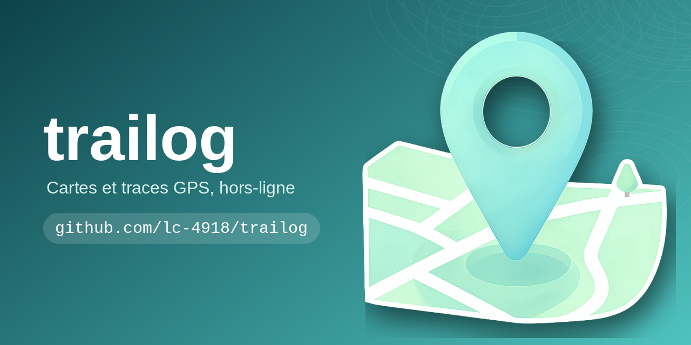
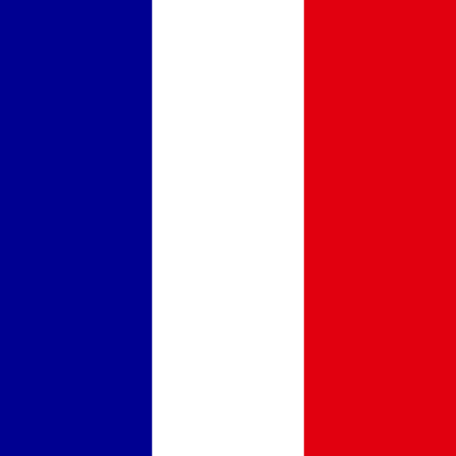
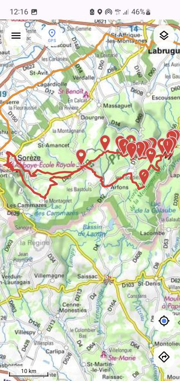
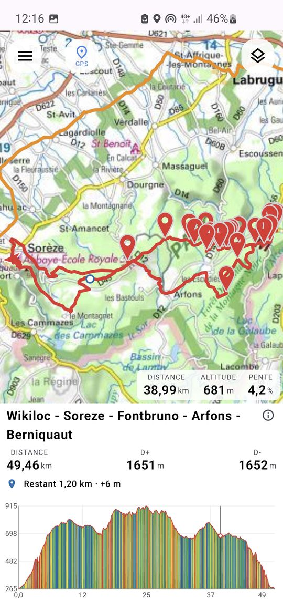
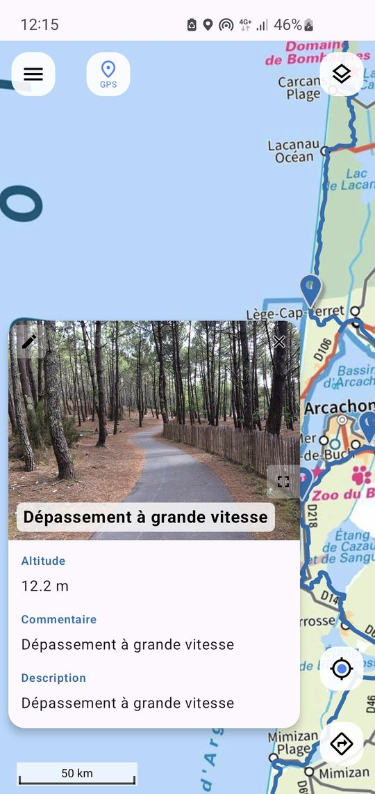
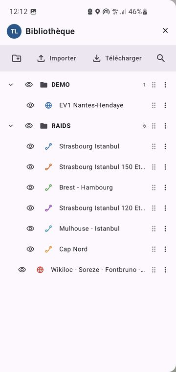
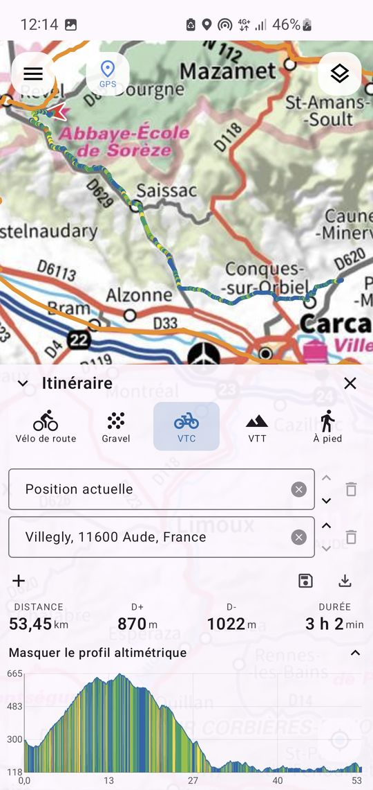
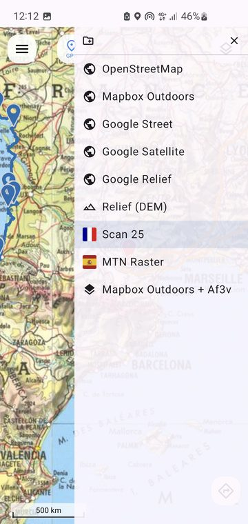
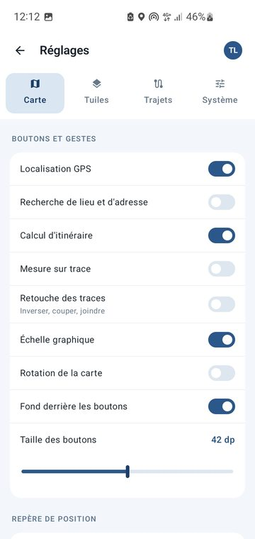

# Trailog

 

**Cartographie et itinéraires hors-ligne pour Android.**

Trailog est une application Android native pour consulter, importer et organiser des
traces GPS (randonnée, vélo, VTT, exploration), sur des fonds de carte personnalisables,
avec un fonctionnement pensé pour le hors-ligne.

[//]: # (<table width="100%">)

[//]: # (  <tr>)

[//]: # (    <td colspan="3" align="center"> Une trace sur la carte</td>)

[//]: # (  </tr>)

[//]: # (  <tr>)

[//]: # (    <td align="center" width="33.3%"> Le profil, synchronisé</td>)

[//]: # (    <td align="center" width="33.3%"> Infobulle, photo comprise</td>)

[//]: # (    <td align="center" width="33.3%"> Bibliothèque des couches</td>)

[//]: # (  </tr>)

[//]: # (  <tr>)

[//]: # (    <td align="center"> Calcul d'itinéraire</td>)

[//]: # (    <td align="center"> Gestionnaire de fonds</td>)

[//]: # (    <td align="center"> Réglages, onglet Carte</td>)

[//]: # (  </tr>)

[//]: # (</table>)

---

## Qu'est-ce que Trailog ?

Trailog permet de garder ses traces organisées localement sur son téléphone, et de les
visualiser sur une carte avec un profil altimétrique synchronisé, sans dépendre d'un service en ligne.

**Cas d'usage typiques :**
- Préparer une sortie : calculer un itinéraire ou importer une trace, et en vérifier les surfaces et le dénivelé avant de partir.
- Télécharger le fond de carte avant la sortie, sur toute la zone ou le long du parcours, pour l'utiliser sans réseau.
- Suivre le parcours sur le terrain, avec une alerte dès que vous vous en éloignez.
- Randonnée, vélo, VTT : consulter un itinéraire préparé à l'avance, hors-ligne.
- Archiver des traces personnelles, classées en dossiers.
- Explorer des fonds de carte spécialisés (IGN, relief, pistes cyclables...).

## Guide de démarrage rapide

1. **Importer une trace** (bouton *Importer*, GPX, GeoJSON ou KML/KMZ), ou **calculer un itinéraire** entre deux étapes ou plus.
2. **Choisir la destination** : un dossier existant ou un nouveau.
3. **Visualiser** : un tap sur l'itinéraire dans le menu latéral l'affiche sur la carte avec son profil altimétrique ; un tap sur l'un place le curseur sur l'autre.
4. **Vérifier les surfaces avant de partir** : les détails montrent la part de revêtu et de non revêtu, surface par surface (asphalte, gravier, terrain, sable...), et les types de voies empruntées.
5. **Emporter la carte** : télécharger le fond de carte le long de l'itinéraire, pour l'avoir sans réseau sur le terrain.
6. **Le suivre avec l'alerte d'éloignement** : Trailog vous prévient dès que vous vous écartez du parcours.

## Caractéristiques principales

- **Carte native** (MapLibre) avec de nombreux fonds configurables, dont des fonds composites (un fond plus une surcouche).
- **Import de traces** GPX, GeoJSON et KML/KMZ avec statistiques immédiates, aussi par le "Ouvrir avec" et le "Partager vers" du téléphone.
- **Profil altimétrique** synchronisé avec un curseur sur la carte, zoom sur une portion et échelle verticale réglable.
- **Surfaces et types de voies** d'une trace ou d'un itinéraire, visibles avant la sortie : revêtu ou non, asphalte, gravier, terrain...
- **Organisation en dossiers** : créer, renommer, déplacer, supprimer, et colorer un dossier entier d'un coup.
- **Points d'intérêt** sur la carte : marqueurs avec infobulles modifiables (titre, texte, liens, photos).
- **Points d'intérêt du parcours** (DATAtourisme en France, OpenStreetMap partout) : hébergements, restaurants, services, eau, filtrables.
- **Cartes hors-ligne** : une zone ou le **couloir le long d'une trace**, vos fonds MBTiles, et les points d'intérêt emportés avec.
- **Recherche d'un lieu ou d'une adresse**, le lieu trouvé se posant sur la carte avec son adresse.
- **Calcul d'itinéraire** de 2 à 25 étapes, pour cinq disciplines, avec profil, surfaces et **recalcul à chaque changement**.
- **Étapes numérotées sur la carte** : A et B aux extrémités, des pastilles numérotées entre les deux, déplaçables à la main ou supprimables.
- **Votre position comme étape**, remise à jour à chaque réouverture du calcul d'itinéraire, ou à la demande par le bouton *Actualiser*.
- **Départ, arrivée ou étape en trois gestes** depuis toute infobulle, ou depuis un appui long n'importe où sur la carte.
- **Appui long sur la carte** : l'adresse du lieu, et la distance et la durée pour l'atteindre depuis votre position ou un autre point.
- **Mesure sur une trace** : la distance entre deux points d'une trace affichée, le long du parcours, sans réseau.
- **Alerte d'éloignement** : choisissez la trace suivie, et un bandeau, et un son si vous le voulez, vous prévient dès que vous vous en écartez.
- **Tableau de bord pendant le suivi** : vitesse, temps et distance faits et restants, dénivelés positif et négatif faits et à venir.
- **Le suivi continue écran éteint**, avec une notification permanente et une option pour garder l'écran allumé.
- **Flèche de cap** qui suit votre direction de déplacement plutôt que la boussole.
- **Envoi à une montre Garmin** : le couloir d'une trace, en tuiles de carte, par Garmin Connect.
- **Mises à jour intégrées**, et interface en français, anglais, allemand, espagnol, catalan, basque, italien et portugais.

## Installation

**Prérequis :** Android 7.0 (API 24) ou supérieur.

### Depuis GitHub Releases (recommandé)

1. Ouvrir la page [Releases](https://github.com/lc-4918/trailog/releases) du dépôt.
2. Télécharger le `.apk` de la dernière version. Chaque release en propose plusieurs : prenez celui
   de l'architecture de votre téléphone - `arm64-v8a` pour tout appareil récent, `armeabi-v7a` pour
   un plus ancien - deux fois plus léger que le fichier `trailog-vX.Y.Z.apk` sans suffixe, qui les
   contient toutes et fonctionne partout en cas de doute.
3. Ouvrir le fichier téléchargé sur votre téléphone (autoriser l'installation depuis une
   source inconnue si demandé par Android).
4. Confirmer l'installation.

> Trailog n'est pas distribué sur le Play Store : GitHub Releases sert de plateforme de
> distribution. Voir la section [Contribution & Développement](#contribution--développement)
> pour le détail du fonctionnement de ce "store".

### Mises à jour

Cette première installation faite, vous n'aurez plus à revenir ici : Trailog vérifie
lui-même s'il existe une version plus récente et vous propose de l'installer.

- Par défaut, la vérification a lieu **au démarrage** de l'application.
- Vous pouvez la passer en **manuel** dans **Réglages -> Système -> Mises à jour**, où un bouton
  permet alors de vérifier quand vous le souhaitez.
- Quand vous acceptez, Trailog télécharge la nouvelle version et lance l'installation. Android
  vous demandera une fois l'autorisation d'installer des applications depuis Trailog : c'est
  normal pour une application distribuée hors magasin, et vous pouvez la retirer à tout moment
  dans les réglages Android.
- Vos traces, dossiers et réglages sont conservés.

## Utilisation avancée

- **Import/export** : GPX, GeoJSON et KML/KMZ en import ; export GeoJSON ; les photos des waypoints GPX sont récupérées.
- **Modifier une infobulle** : le crayon change le titre, le texte, le lien et les photos, ou supprime le point.
- **Emporter une carte hors-ligne** : délimitez une zone, ou choisissez une trace pour son couloir, réglez le zoom, et les tuiles vont dans une couche.
- **Fonds de carte** : gérez les fournisseurs de tuiles (URL, clé API) et créez des fonds composites dans les réglages.
- **Fonds hors-ligne locaux** : importez un fichier `.mbtiles` pour l'utiliser sans connexion.
- **Légende d'un fond** : certains fonds, comme les voies cyclables AF3V, déplient leur légende depuis un bouton de la carte.
- **Chercher un lieu** : activez le géocodage dans **Réglages / Carte** ; les résultats mêlent l'importance du lieu et sa distance.
- **Interroger un point** : un appui long hors d'un marqueur pose une épingle, donne l'adresse et propose deux mesures.
- **Distance et durée jusqu'au point** : celles de l'itinéraire recommandé pour la discipline réglée dans *Réglages / Trajets* (Photon et Valhalla, ou vos instances).
- **Déplacer une étape** : un tap sur une pastille numérotée propose *Définir comme arrivée* ou *Supprimer* ; un appui bref la saisit pour la déposer ailleurs.
- **Prolonger un trajet** : un nouveau départ ou une nouvelle arrivée posés depuis la carte gardent l'ancien bout comme étape.
- **Mesurer une portion de trace** : activez le bouton règle dans **Réglages / Carte**, puis tapez deux points sur une trace.
- **Colorer suivant la pente** : désactivé par défaut, dans *Réglages / Trajets*, pour l'itinéraire sur la carte et son profil.
- **Relief** : activez l'ombrage de relief dans les réglages carte.
- **Profil altimétrique** : zoom sur une portion (trois niveaux), lissage et échelle verticale, par exemple 1 cm = 100 m.
- **Envoi à une montre Garmin** : réglez la largeur du couloir, puis lancez la synchronisation depuis la montre.
- **Personnalisation** : avatar, unités, ouverture du menu, tolérance tactile, position des infobulles, taille des textes.

## Données & Confidentialité

- Aucun suivi en ligne, aucune télémétrie, aucun compte.
- Toutes les traces, points et réglages sont stockés **localement** sur l'appareil.
- Les requêtes réseau se limitent au chargement des tuiles auprès des fournisseurs que vous
  avez configurés, et à la vérification des mises à jour auprès de GitHub. Cette dernière ne
  transmet rien sur vous : elle lit un fichier public indiquant la dernière version publiée.
  Vous pouvez la passer en manuel dans les réglages.
- La **recherche d'un lieu**, l'**adresse d'un point** et les **mesures de distance** sont les seules
  fonctions qui interrogent un service tiers pendant que vous vous en servez. Une recherche envoie le
  texte tapé, et rien d'autre — ni votre position, ni l'endroit que vous regardez. L'adresse d'un point
  envoie ce point, celui que vous venez de désigner du doigt. Une mesure de distance envoie les deux
  points concernés (dont votre position GPS si vous la demandez depuis celle-ci) au service
  d'itinéraire. La recherche par le nom est **désactivée par défaut**, et les deux services visés sont
  configurables : vous pouvez héberger les vôtres.
- La **couche des points d'intérêt**, quand vous l'allumez, demande à ses deux sources - DATAtourisme et
  OpenStreetMap - les lieux de la zone que vous regardez, et rien d'autre : ni qui vous êtes, ni où vous
  êtes. Elle est **éteinte par défaut**, et ne redemande rien tant que la carte reste dans ce qui a déjà
  été chargé.
- Le **suivi de position** ne quitte jamais l'appareil : ni enregistré, ni envoyé, ni conservé une fois le
  suivi arrêté. Il tourne dans un service que sa notification annonce en permanence, et que vous arrêtez
  d'un tap. Trailog ne demande pas l'autorisation de localisation en arrière-plan : le suivi ne démarre
  jamais que d'un geste de votre part.
- La **mesure sur une trace**, elle, ne sort pas du téléphone : elle se lit sur la trace que vous avez
  importée, et n'interroge aucun service.

## Contribution & Développement

Le développement se fait ouvertement sur GitHub :
- Guide technique complet (installation, architecture, build) : voir [`DEVELOPER.md`](DEVELOPER.md).
- Ce que fait l'application, en détail : voir [`SPEC.md`](SPEC.md) ; les fonds de carte et leurs règles :
  voir [`BASEMAPS.md`](BASEMAPS.md).
- Fonctionnement du CI/CD et des releases : voir [`WORKFLOW.md`](WORKFLOW.md).
- Signaler un bug ou proposer une fonctionnalité : [GitHub Issues](https://github.com/lc-4918/trailog/issues).

## Licence

Trailog est distribué sous licence **GPL v3**. Voir le fichier [`LICENSE`](../LICENSE).

Les profils de calcul d'itinéraire livrés dans `app/src/main/assets/brouter/` sont repris tels quels du
projet [BRouter](https://github.com/abrensch/brouter) (licence MIT), qui en garde la paternité.

## Contact

Pour toute question, ouvrez une [discussion ou une issue](https://github.com/lc-4918/trailog/issues)
sur le dépôt GitHub.
